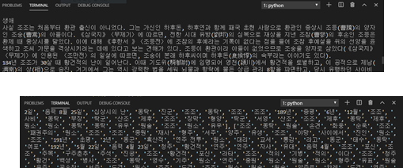

# 묻고 위키로 가

## 0. 배포 URL

### https://final-askwiki.herokuapp.com/

## 1. 기술 스택

- Python, Django : 기본 개발 언어, 웹 프레임 워크
- Komaran : 텍스트 분석을 위한 형태소 분석기
- Wikipedia OpenAPI : 텍스트 데이터 추출을 위한 위키피디아 API
- HTML5, JavaScript, CSS, Bootstrap, JQuery, ajax : 웹 개발을 위한 개발언어들
- Github : 협업 및 버전관리를 위한 Git
- Visual Studio Code : 개발하는데 사용한 통합 개발 환경(IDE)

## 2. 기본 모델 

## 3. 데이터 분석 과정

전체 데이터를 가져와서 형태소 분석을 통해 고유명사만 추출, 

하위 내부 문서(서브섹션)이 있는 경우는 해당 문서들을 이용해 TF-IDF 분석을 하였고, 유의미한 내부 문서가 존재하지 않는 경우에는 해당 고유명사들을 카운팅 하는 방식으로만 키워드 추출

ex): 조조의 경우 적벽대전, 동탁암살, 서주공략 등등의 주요 사건들이 내부 문서로 나뉘어져있었기 때문에 TF-IDF로 해당 단어의 중요도를 분석하였다.

### TF-IDF 분석 과정

TF는 단어 빈도로 해당 문서에 그 단어가 얼마나 자주 언급 되었는지에 대한 수치고

DF는 문서 빈도로 해당 단어가 다른 문서들에 얼마나 흔하게 언급되었는지에 대한 수치이므로 

DF에 역수를 취한 IDF값(역수이기 때문에 다른 문서에는 잘 없는 희귀한 단어일수록 높아짐) 을 구하고 

TF와 IDF를 곱하여 유저가 입력한 가짓수만큼 상위 키워드를 추출하였다.

 

## 4. 시연화면

### 기본 메인 화면 

간단한 검색 화면, 단어를 입력하면 해당 단어와 관련된 키워드들을 찾아준다.

### 키워드 출력 화면

해당 단어에 관한 키워드들이 출력되고, 원하는 갯수만큼 가지의 수를 늘릴 수 있다. 

(Max 10개)

### 하위 키워드 출력 화면

해당 이미지를 클릭하면 동적으로 가지가 펼쳐진다. ex) 카카오톡 -> 채팅 -> 프로토콜,PC통신,실시간,소프트웨어

### 에러 페이지

검색어를 입력하지 않거나 해당 검색어의 위키 페이지가 존재하지 않을 경우 에러페이지로 redirect 시켜준다.

### 동음 이의어 페이지

위키피디아 API내부의 카테고리 항목을 체크해주는 기능을 이용하여 동음 이의어 페이지일 경우 별도의 페이지로 이동시켜준다.

해당 동음이의어 중 원하는 결과를 클릭할 시

기존의 키워드 추출 화면으로 넘어가게 된다.

# 5. 개선사항

・ 인기 검색어 서비스

    검색을 할 때 마다 해당 키워드에 대한 count를 증가시키는 방식으로 메인 페이지에 인기 검색어들을 보여주려고 하였으나 배포에 생각보다 시간이 많이 들어서 나중에 추가하는 방향으로 결정

・ 서비스 성능 개선

    검색 속도를 빠르게 하기 위해 검색 시 해당 단어를 DB에 저장하여 기존에 검색한 적이 있는 키워드는 조건문으로 pass 를 하도록 구현하였는데, heroku 서버의 특성상 많은 sql쿼리를 받지 못하여 서버의 안정성이 낮아지는 결과를 초래하였다.
    
    sql문의 빈도를 줄이거나 AWS 등을 이용한 서버 개선 등으로 서비스 성능 개선이 필요함.

・ UI 디자인 추가

    심심한 메인화면에 여러가지 기능을 추가, 혹은 전체적인 디자인 다듬기를 하면 좋을 것 같다.

・ 다양한 플랫폼 서비스

    반응형 웹으로 모바일에서 사이트를 열 때 좀 더 깔끔하게 보여주는 식으로 개선

# 6. 느낀점

과정을 처음 배우면서부터 데이터 분석에 관심이 있었지만 '오픈API를 활용한 빅데이터 전처리 및 시각화' 라는 과정에 어울리지 않게 매번 웹 개발에 대해 공부를 하거나 프로젝트를 진행하게 되었다.

그러던 중 마지막 종합 프로젝트때 관심있던 데이터 전처리, 분석 프로젝트를 진행할 수 있었고 다른 팀원들과 웹 디자인, 백엔드, 프론트 등등 분업이 잘 되어서 원하는 분야에 대해서 프로젝트를 진행할 수 있었다.

협업 과정에서 충돌도 전혀 없었고 각자 맡은 부분을 잘 수행해주면서도 어렵거나 막히는 부분은 서로 얘기를 해 나가면서 즐겁게 진행을 했던 프로젝트였다.

